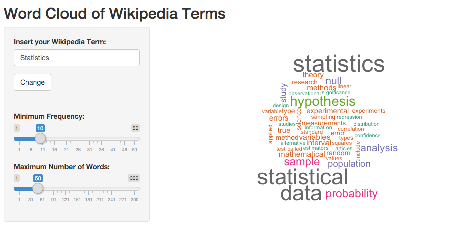

Word cloud creator scraping wikipedia pages by key term
========================================================
author: Jose A. Ruiperez Valiente
date: February 27, 2016
font-family: 'Helvetica'

Introduction
========================================================

In this project I have developed a word cloud generator based on web scraping of wikipedia pages. It has the following features:

- You insert a wikipedia term and it scrapes the HTML info
- It cleans the text from HTML content, prepositions, a other not useful words or signs. Although it just some basic cleaning and not perfect at all.
- You can adjust the maximum number of words you want to display
- You can adjust the minimum frequency to add a word to the cloud

Wikipedia web scraping and cleaning
========================================================


```r
  require(rvest)
  wiki_url = "https://en.wikipedia.org/wiki/Statistics"
  # I take the body if the page
  text <- html_text(read_html(wiki_url) %>% html_nodes("body"))
  # Clean
  text <- gsub("\n", "", gsub("\t", "", text))
  # Substring of the total text scraped from the wikipedia page.
  substr(text, 182, 305)
```

```
[1] "Statistics used in standardized testing assessment are shown. The scales include standard deviations, cumulative percentages"
```

Count frequency of words and order
========================================================
Use Corpus representation from tm package


```r
myCorpus = Corpus(VectorSource(text))
myDTM = TermDocumentMatrix(myCorpus,control = list(minWordLength = 1))
```


```r
  myDTM = TermDocumentMatrix(myCorpus,control = list(minWordLength = 1))
  m = as.matrix(myDTM)
  # Showing the 5 more frequent words of Statistics wikipedia page
  sort(rowSums(m), decreasing = TRUE)[1:5]
```

```
 statistics statistical        data  hypothesis probability 
         87          79          77          44          35 
```

App
========================================================

This is the final [url of the app](https://josearuiperez.shinyapps.io/Word_cloud_generator_wikipedia/)

And the GitHub repository




